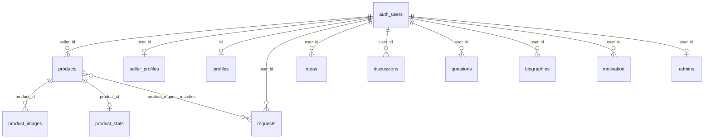

# Bharat Startup — Complete Repository Intelligence Report

> **Generated**: 2026-05-08 | **Commit**: 43deb059 | **Stack**: Next.js 16 + Supabase + TailwindCSS 4

---

# 1. COMPLETE PROJECT TREE

```
bharat-startup/
├── app/                          # Next.js App Router (pages & routes)
│   ├── layout.js                 # Root layout: ThemeProvider, QueryProvider, Navbar, Toaster
│   ├── page.js                   # Home — Community Feed (861 lines, client component)
│   ├── globals.css               # TailwindCSS v4 import + CSS variables
│   ├── favicon.ico
│   ├── constants/
│   │   └── marketplaceCategories.js  # Re-exports from lib/marketplace/taxonomy
│   ├── login/page.js             # Auth: Login/Register/Forgot (900 lines)
│   ├── reset-password/page.js    # Password reset flow
│   ├── dashboard/page.js         # User dashboard: products, requests, matches
│   ├── profile/page.js           # User profile: avatar upload, edit modal
│   ├── chat/
│   │   ├── layout.js             # Minimal passthrough
│   │   └── page.js               # Real-time chat: ChatList + ChatRoom + GroupInfoPanel
│   ├── marketplace/
│   │   ├── layout.js             # SavedProvider + QueryClientProvider
│   │   ├── page.js               # Redirects to /marketplace/category/all
│   │   ├── category/[slug]/page.js  # Category browse with product grid (688 lines)
│   │   ├── deals/                # Empty route stub
│   │   ├── new-arrivals/         # Empty route stub
│   │   ├── product/              # Empty route stub
│   │   ├── saved/                # Empty route stub
│   │   └── trending/             # Empty route stub
│   ├── products/[id]/            # Product detail page
│   │   ├── page.js               # Product detail with seller info
│   │   ├── WhatsAppButton.js     # WhatsApp CTA component
│   │   └── error.js              # Error boundary
│   ├── add-product/page.js       # Add product form (237 lines)
│   ├── add-request/page.js       # Post buyer request form (169 lines)
│   ├── blog/
│   │   ├── page.js               # Blog feed with personalized ranking
│   │   ├── [slug]/               # Blog post detail
│   │   └── new/                  # Blog editor
│   ├── community/page.js         # Community feed (all content types)
│   ├── discussions/new/          # New discussion form
│   ├── ideas/new/                # New idea form
│   ├── motivation/new/           # New motivation post form
│   ├── biographies/new/          # New biography form
│   ├── qa/new/                   # New Q&A form
│   ├── organizations/
│   │   ├── page.js               # Organization discovery with infinite scroll
│   │   ├── [slug]/               # Org detail
│   │   ├── components/           # Org-specific components & hooks
│   │   ├── create/               # Create org form
│   │   ├── industries/           # Industry browser
│   │   └── verified/             # Verified orgs filter
│   ├── admin/verify/             # Admin verification panel
│   └── auth/callback/            # OAuth callback handler
│
├── components/
│   ├── common/                   # Shared: Avatar, Button, Spinner, Navbar (56KB!)
│   ├── ui/                       # Design system: Container, GlassCard, SectionHeader, etc.
│   ├── marketplace/              # 16 components: ProductCard, CategoryExplorer, etc.
│   ├── chat/                     # 7 components: ChatList, ChatRoom, Composer, etc.
│   ├── blog/                     # post-preview, tag-input
│   ├── community/                # DiscussionThread
│   ├── panels/                   # GroupInfoPanel, InviteSection, ProfileCard
│   ├── motion/                   # transitions.js, variants.js (Framer Motion)
│   ├── sections/                 # hero/, conversion/, marketplace/, social/
│   ├── filters/                  # Empty directory
│   ├── layout/                   # Footer, HomeLayout
│   └── profile/                  # Empty directory
│
├── lib/
│   ├── supabase.js               # Browser Supabase client (anon key)
│   ├── supabase-server.js        # Server Supabase client (service role key)
│   ├── contentService.js         # CRUD: ideas, discussions, questions, biographies, motivation
│   ├── utils.js                  # cn() — clsx + tailwind-merge
│   ├── feed/feedClient.js        # Personalized feed fetcher (RPC: get_personalized_feed_v8)
│   ├── hooks/                    # useFeed, useLRUCache, useEngagementNormalizer, etc.
│   ├── utils/                    # validateContent, slugify, useAuthUser, withRetry, etc.
│   ├── auth/signup.js            # signUpWithEmail (BROKEN: missing supabase import)
│   ├── api/                      # feed.js, products.js, requests.js, useHomeData.js
│   ├── supabase/marketplace.js   # fetchProducts with manual seller hydration
│   └── marketplace/              # discovery, ranking, sorting, taxonomy, mockData, etc.
│
├── services/
│   ├── productService.js         # Enterprise product data layer with trust metrics
│   ├── categoryService.js        # Industry taxonomy + slug resolution
│   ├── feedService.js            # Marketplace feed management
│   └── searchService.js          # Postgres FTS search
│
├── hooks/                        # 8 hooks: useMarketplaceFeed, useChatSubscription, etc.
├── providers/                    # QueryProvider (React Query), ThemeProvider (dark/light)
├── context/                      # SavedContext (localStorage-based product bookmarks)
├── utils/                        # slugResolver.js
├── src/                          # Scaffold: ai/, config/, domains/, engine/, etc. (EMPTY)
├── public/                       # SVG assets only (file, globe, next, vercel, window)
└── configs                       # next.config.js, tsconfig, eslint, postcss, package.json
```

---

# 2. COMPLETE APP UNDERSTANDING

## What This App Is
**Bharat Startup** is an India-focused B2B marketplace + community platform with two distinct product surfaces:

1. **B2B Marketplace**: Sellers list products (with images, WhatsApp contact, pricing), buyers post requests, and the system attempts AI-powered matching.
2. **Community Platform**: Multi-content-type social feed (blogs, ideas, Q&A, discussions, biographies, motivation posts) with personalized ranking and engagement tracking.

## Architecture Style
- **Next.js 16 App Router** with predominantly **client-side rendering** (`'use client'` on nearly every page)
- **Supabase** as BaaS: Auth, PostgreSQL, Storage, RPC functions, Realtime
- **React Query** for server state caching
- **Framer Motion** for animations
- **TailwindCSS v4** for styling

## Development Stage
**Early-to-mid MVP** — Core CRUD flows work, but many subsystems are incomplete scaffolds. The `src/` directory is entirely empty placeholder structure. Several marketplace sub-routes are stubs. The chat system has real implementation but relies on Supabase tables that may not be fully set up.

## How Systems Connect

```
┌─────────────┐     ┌──────────────┐     ┌────────────────┐
│  Next.js UI  │────▶│ lib/supabase │────▶│   Supabase DB  │
│  (App Router)│     │  .js (anon)  │     │  (PostgreSQL)  │
└──────┬───────┘     └──────────────┘     └────────────────┘
       │                                          │
       ├─▶ lib/contentService.js ─────────────────┤ (ideas, discussions, etc.)
       ├─▶ lib/feed/feedClient.js ────────────────┤ (RPC: get_personalized_feed_v8)
       ├─▶ lib/supabase/marketplace.js ───────────┤ (products + seller_profiles)
       ├─▶ services/productService.js ────────────┤ (products + trust metrics)
       └─▶ hooks/ (useFeed, useMarketplaceFeed) ──┘
```

---

# 3. KEY FILE-BY-FILE ANALYSIS

## Root Configuration

| File | Purpose | Status |
|------|---------|--------|
| `package.json` | Next.js 16, React 19, Supabase, TanStack Query, Framer Motion, Sonner | ✅ Active |
| `.env.local` | Supabase URL + anon key (exposed), service role = placeholder | ⚠️ Service key missing |
| `next.config.js` | Image remotePatterns (unsplash, picsum), removeConsole in prod | ✅ Active |
| `next.config.ts` | Duplicate — minimal TS config | ⚠️ Duplicate |
| `globals.css` | TailwindCSS v4 `@import`, CSS variables, system font stack | ✅ Active |

## Core Libraries

| File | Purpose | Supabase Tables | Status |
|------|---------|----------------|--------|
| `lib/supabase.js` | Browser client (anon key) | — | ✅ |
| `lib/supabase-server.js` | Server client (service role, lazy validation) | — | ⚠️ Placeholder key |
| `lib/contentService.js` | CRUD for ideas, discussions, questions, biographies, motivation | ideas, discussions, questions, biographies, motivation | ✅ Real |
| `lib/feed/feedClient.js` | Feed fetcher via `get_personalized_feed_v8` RPC + session dedup | community_feed (RPC) | ✅ Real |
| `lib/supabase/marketplace.js` | Product queries with manual seller hydration | products, product_images, product_stats, seller_profiles | ✅ Real |
| `lib/utils/validateContent.js` | Title/content/tags validation rules | — | ✅ Real |
| `lib/utils/slugify.js` | Type-aware slug generation (blog-, idea-, q-, d-, etc.) | — | ✅ Real |
| `lib/utils/useAuthUser.js` | Auth hook with safe redirect validation | — | ✅ Real |
| `lib/auth/signup.js` | Email signup helper | — | 🔴 BROKEN: `supabase` not imported |
| `lib/marketplace/taxonomy.js` | 24KB B2B industry category tree | — | ✅ Real (hardcoded data) |
| `lib/marketplace/ranking.js` | Trending score: views, clicks, inquiries, saves, velocity | — | ✅ Real |
| `lib/marketplace/mockData.js` | 1 fallback product for offline dev | — | ⚠️ Minimal |
| `lib/marketplace/discovery.js` | Client-side feed filter/sort | — | ✅ Real |

## Services Layer

| File | Purpose | Status |
|------|---------|--------|
| `services/productService.js` | Enterprise product layer with trust metrics + seller hydration | ✅ Real (duplicate of lib/supabase/marketplace.js) |
| `services/categoryService.js` | Industry context resolution via taxonomy | ✅ Real |
| `services/feedService.js` | Marketplace feed wrapper (AI re-ranking placeholder) | ⚠️ Partial |
| `services/searchService.js` | Postgres FTS via `search_vector` column | ✅ Real |

---

# 4. FRONTEND ARCHITECTURE SUMMARY

## Route Map

| Route | Page Type | Auth Required | Backend Connected |
|-------|-----------|---------------|-------------------|
| `/` | Community Feed | Yes (for feed) | ✅ RPC: get_personalized_feed_v8 |
| `/login` | Auth (login/register/forgot) | No | ✅ Supabase Auth |
| `/reset-password` | Password reset | No | ✅ Supabase Auth |
| `/dashboard` | User dashboard | Yes | ✅ products, requests, product_request_matches, admins |
| `/profile` | User profile | Yes | ✅ profiles, avatars storage |
| `/chat` | Real-time messaging | Yes | ✅ Supabase Realtime |
| `/marketplace` | Redirect to /category/all | No | — |
| `/marketplace/category/[slug]` | Product browse | No | ✅ products, seller_profiles |
| `/products/[id]` | Product detail | No | ✅ products |
| `/add-product` | Add product form | Yes | ✅ products, product-images storage |
| `/add-request` | Post buyer request | Yes | ✅ requests |
| `/blog` | Blog feed | Yes | ✅ RPC feed |
| `/blog/new` | Blog editor | Yes | ✅ (assumed) |
| `/community` | Community feed | Yes (for feed) | ✅ RPC feed |
| `/organizations` | Org discovery | No | ✅ organizations (via hooks) |
| `/ideas/new` | New idea form | Yes | ✅ ideas table |
| `/discussions/new` | New discussion | Yes | ✅ discussions table |
| `/qa/new` | New Q&A | Yes | ✅ questions table |
| `/biographies/new` | New biography | Yes | ✅ biographies table |
| `/motivation/new` | New motivation | Yes | ✅ motivation table |
| `/admin/verify` | Admin panel | Yes (admin) | ✅ admins table |

## UI Component Hierarchy
```
RootLayout
├── ThemeProvider (dark/light mode via localStorage)
├── QueryProvider (React Query)
├── Navbar (56KB — massive, includes auth state, mobile menu, notifications)
├── Toaster (Sonner)
└── {children} — page content
    └── MarketplaceLayout (for /marketplace/* routes)
        ├── SavedProvider (localStorage bookmarks)
        └── QueryClientProvider (duplicate!)
```

## State Management
- **Auth**: Direct `supabase.auth.getSession()` calls per page (no centralized auth context)
- **Theme**: `ThemeProvider` with `useTheme()` hook
- **Saved Products**: `SavedContext` using localStorage
- **Server State**: React Query (TanStack) for marketplace data
- **Feed State**: Custom `useFeed` / `useCommunityFeed` hooks with cursor-based pagination
- **Engagement**: Buffered batch tracking via `batch_record_engagement_v3` RPC

## Reusable Component Inventory

| Component | Location | Used By |
|-----------|----------|---------|
| `Button` | `components/common/Button.js` + `components/ui/Button.js` | Login, Profile, Dashboard |
| `Container` | `components/ui/Container.js` | Home, Blog, Community |
| `Avatar` | `components/common/Avatar.js` | Home, Community, Chat |
| `Spinner` | `components/common/Spinner.js` | Login, Profile |
| `GlassCard` | `components/ui/GlassCard.js` | Various |
| `Navbar` | `components/common/Navbar.js` | Root Layout |

---

# 5. BACKEND ARCHITECTURE SUMMARY

## Supabase Tables (Inferred from Code)

| Table | Used By | Operations |
|-------|---------|------------|
| `products` | marketplace, dashboard, add-product | SELECT, INSERT, DELETE |
| `product_images` | marketplace (joined) | SELECT |
| `product_stats` | marketplace (joined) | SELECT |
| `seller_profiles` | marketplace (manual hydration) | SELECT |
| `requests` | dashboard, add-request | SELECT, INSERT, DELETE |
| `product_request_matches` | dashboard | SELECT |
| `profiles` | profile page | SELECT, INSERT, UPDATE |
| `admins` | dashboard | SELECT |
| `ideas` | contentService | INSERT |
| `discussions` | contentService | INSERT |
| `questions` | contentService | INSERT |
| `biographies` | contentService | INSERT |
| `motivation` | contentService | INSERT |
| `organizations` | organizations page | SELECT (via infinite query) |

## Supabase RPCs

| RPC | Called From | Purpose |
|-----|-----------|---------|
| `get_personalized_feed_v8` | feedClient.js | Personalized community feed |
| `batch_record_engagement_v3` | feedClient.js, page.js | Batch engagement events |
| `batch_record_engagement_v2` | contentService.js | Legacy engagement (unused?) |
| `refresh_community_feed` | contentService.js | Feed refresh |

## Supabase Storage Buckets
- `product-images` — Product photo uploads
- `avatars` — User profile pictures

## Auth Flow
```
Login Page → supabase.auth.signInWithPassword()
           → supabase.auth.signUp() (with email confirmation)
           → supabase.auth.signInWithOAuth() (Google, GitHub)
           → supabase.auth.resetPasswordForEmail()
           
Callback  → /auth/callback (OAuth redirect handler)

Guards    → Each page checks auth independently (no middleware)
           → useAuthUser() hook available but not universally used
```

---

# 6. DATABASE & SUPABASE SUMMARY

- **No centralized schema file** — table structure is inferred from queries
- **No migrations** — schema managed via Supabase dashboard
- **Manual seller hydration** — `products.seller_id → auth.users.id ← seller_profiles.user_id` (no FK join)
- **Full Text Search** — `search_vector` column on products table (used by searchService)
- **No RLS policies visible** — security depends entirely on Supabase dashboard config
- **Service role key** is a placeholder (`REPLACE_WITH_YOUR_SERVICE_ROLE_KEY`)

---

# 7. AUTHENTICATION FLOW SUMMARY

| Step | Implementation | Status |
|------|---------------|--------|
| Email/Password Login | `supabase.auth.signInWithPassword()` | ✅ Complete |
| Registration | `supabase.auth.signUp()` with email confirmation | ✅ Complete |
| OAuth (Google/GitHub) | `supabase.auth.signInWithOAuth()` | ✅ Complete |
| Password Reset | `supabase.auth.resetPasswordForEmail()` | ✅ Complete |
| Session Check | Per-page `getSession()` calls | ⚠️ No centralized middleware |
| Auth Guards | Manual redirects in each page | ⚠️ Inconsistent |
| Remember Me | localStorage flag only (no actual session extension) | ⚠️ Cosmetic |

---

# 8. API FLOW SUMMARY

There are **no custom API routes** (`app/api/` directory does not exist). All data flows are:
- **Client → Supabase directly** (via anon key)
- **Server → Supabase** (via service role, but key is placeholder)

This means all database access rules depend entirely on Supabase RLS policies.

---

# 9. FEATURE STATUS TABLE

| Feature | Status | Completion | Key Files | Backend? | Issues |
|---------|--------|-----------|-----------|----------|--------|
| **Auth (Login/Register)** | ✅ Complete | 95% | `app/login/page.js` | ✅ | Password reset redirect works |
| **Community Feed** | ✅ Complete | 90% | `app/page.js`, `lib/feed/feedClient.js` | ✅ | Engagement tracking, diversity, prefetch all work |
| **Blog Feed** | ✅ Complete | 85% | `app/blog/page.js`, `lib/hooks/useFeed.js` | ✅ | Requires auth to view |
| **Content Creation** | ✅ Complete | 80% | `lib/contentService.js`, `app/*/new/` | ✅ | All 6 types (blog, idea, Q&A, discussion, bio, motivation) |
| **B2B Marketplace** | ✅ Functional | 75% | `app/marketplace/`, `services/productService.js` | ✅ | Category browse works; sub-routes are stubs |
| **Product Listing** | ✅ Complete | 85% | `app/add-product/page.js` | ✅ | Image upload to Supabase Storage |
| **Buyer Requests** | ✅ Complete | 80% | `app/add-request/page.js` | ✅ | WhatsApp validation included |
| **Dashboard** | ✅ Complete | 80% | `app/dashboard/page.js` | ✅ | Products, requests, matches, admin check |
| **Profile** | ✅ Complete | 80% | `app/profile/page.js` | ✅ | Avatar upload, profile edit modal |
| **Chat/Messaging** | ✅ Functional | 70% | `app/chat/page.js`, `components/chat/` | ✅ | Real-time via Supabase; complex UI (ChatList, ChatRoom, Composer) |
| **Organizations** | ✅ Functional | 65% | `app/organizations/page.js` | ✅ | Infinite scroll, search, sort, verify filter |
| **Saved Products** | ⚠️ Partial | 40% | `context/SavedContext.js` | ❌ | localStorage only, no server sync |
| **Search (FTS)** | ⚠️ Partial | 50% | `services/searchService.js` | ✅ | Requires `search_vector` column; may not be set up |
| **Admin Panel** | ⚠️ Stub | 30% | `app/admin/verify/` | Partial | Only admin check exists in dashboard |
| **Notifications** | ❌ Missing | 0% | — | ❌ | No notification system exists |
| **AI Matchmaking** | ❌ Placeholder | 5% | `services/feedService.js` comments | ❌ | "Future: Apply AI Re-ranking" comments only |
| **Trending/Deals/Saved routes** | ❌ Empty stubs | 0% | `app/marketplace/deals/`, etc. | ❌ | Directory exists, no page.js |
| **`src/` Architecture** | ❌ Empty scaffold | 0% | `src/ai/`, `src/engine/`, etc. | ❌ | 13 empty subdirectories |

---

# 10. MAJOR ISSUES DETECTED

## 🔴 Critical

| Issue | Location | Impact |
|-------|----------|--------|
| **`lib/auth/signup.js` — `supabase` not imported** | `lib/auth/signup.js` | Runtime crash if called |
| **Service Role Key is placeholder** | `.env.local` line 3 | Server-side queries will fail |
| **No API routes or middleware** | Missing `app/api/`, `middleware.ts` | No server-side auth validation; all DB access client-side |
| **Anon key exposed in `.env.local`** | `.env.local` | Expected for Supabase, but RLS policies MUST be configured |
| **`community/page.js` imports `next/image` as `Link`** | `app/community/page.js` line 8 | `import Link from 'next/image'` — will crash at runtime |

## 🟠 Significant

| Issue | Location | Impact |
|-------|----------|--------|
| **Duplicate QueryClientProvider** | Root layout + marketplace layout | Nested providers; potential cache isolation |
| **Duplicate `fetchProducts`** | `lib/supabase/marketplace.js` + `services/productService.js` | Same logic in two files |
| **Duplicate Button components** | `components/common/Button.js` + `components/ui/Button.js` | Import confusion across pages |
| **Duplicate Avatar components** | `components/common/Avatar.js` + `components/ui/Avatar.js` | Same pattern |
| **Massive Navbar (56KB)** | `components/common/Navbar.js` | Should be split into sub-components |
| **No centralized auth context** | Every page re-implements `getSession()` | Code duplication, inconsistent guards |
| **`src/` directory entirely empty** | `src/` (13 subdirectories) | Dead scaffolding, misleading structure |
| **`next.config.ts` and `next.config.js` both exist** | Root | Potential config conflict |

## 🟡 Minor / Tech Debt

| Issue | Details |
|-------|---------|
| `usePostTracking` duplicated in 3 files | `app/page.js`, `app/blog/page.js`, `app/community/page.js` |
| `CONTENT_CONFIG` duplicated in 2 files | `app/page.js`, `app/community/page.js` |
| Engagement RPC version mismatch | `batch_record_engagement_v2` vs `v3` used in different files |
| `Remember Me` checkbox is cosmetic | Only sets localStorage flag, doesn't extend session |
| Empty `components/filters/` and `components/profile/` dirs | Dead directories |
| `.aider.chat.history.md` (420KB) committed | Should be gitignored |
| No error boundaries on most pages | Only `products/[id]/error.js` exists |
| No loading.js files for route segments | No streaming/suspense boundaries |

---

# 11. RECOMMENDED NEXT DEVELOPMENT PRIORITIES

## Priority 1: Immediate Fixes (Day 1)

- [ ] **Fix `community/page.js` broken import**: Change `import Link from 'next/image'` to `import Link from 'next/link'`
- [ ] **Fix `lib/auth/signup.js`**: Add `import { supabase } from '@/lib/supabase'`
- [ ] **Remove duplicate `next.config.ts`** — keep only `next.config.js`
- [ ] **Set real `SUPABASE_SERVICE_ROLE_KEY`** in `.env.local`

## Priority 2: Architecture Cleanup (Week 1)

- [ ] **Consolidate duplicate modules**: Merge `lib/supabase/marketplace.js` and `services/productService.js`
- [ ] **Consolidate Button/Avatar components**: Pick one location, update all imports
- [ ] **Create centralized auth context**: Replace per-page `getSession()` with shared `AuthProvider`
- [ ] **Split Navbar** (56KB) into sub-components: NavLinks, MobileMenu, AuthStatus, NotificationBell
- [ ] **Delete empty `src/` scaffold** — it adds confusion
- [ ] **Extract `usePostTracking`** to `lib/hooks/` — used in 3 pages identically
- [ ] **Add `middleware.ts`** for server-side auth protection on `/dashboard`, `/chat`, `/profile`, `/add-*`

## Priority 3: Missing Core Systems (Weeks 2-3)

- [ ] **Implement `/marketplace/deals`, `/trending`, `/new-arrivals`, `/saved` pages** (currently empty stubs)
- [ ] **Add server-side saved products** (replace localStorage with Supabase table)
- [ ] **Build notification system** (in-app + optional email)
- [ ] **Add `loading.js` and `error.js`** for all route segments
- [ ] **Implement proper API routes** (`app/api/`) for sensitive operations instead of direct client-side Supabase calls

## Priority 4: MVP-Critical Improvements (Month 1)

- [ ] **Verify Supabase RLS policies** are properly configured for all tables
- [ ] **Add image optimization** — product images should use Next.js `<Image>` consistently
- [ ] **Implement server components** where possible (category pages, org listing) for SEO and performance
- [ ] **Add proper SEO metadata** to marketplace and product pages
- [ ] **Build onboarding flow** — currently users land on feed with no guidance
- [ ] **Implement product edit functionality** (dashboard has Edit button but `/products/[id]/edit` route doesn't exist)

---

# APPENDIX: Supabase Table Relationship Map



---

*This report was generated by analyzing 131 source files across 416 nodes and 537 edges in the dependency graph. All findings are based on actual file content and import tracing.*
